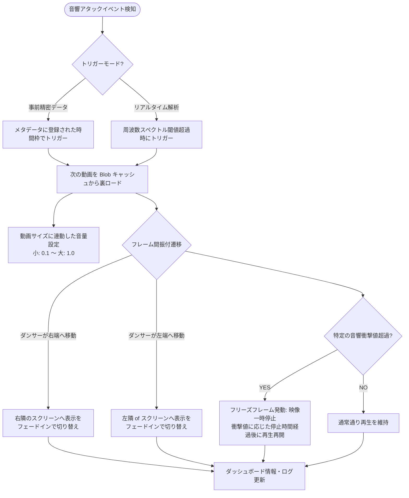

# skinslides: System & Logic Charts (v1.10.5)

本ドキュメントは、現在の `skinslides` (v1.10.5) のシステムアーキテクチャ（システム図）および再生・トリガー制御のロジックフロー（ロジック図）をまとめたものです。

---

## 1. System Chart (システム構造図)

システムのコンポーネント構成およびデータ/コントロールフローを示します。

```mermaid
graph TD
    subgraph Client [クライアントブラウザ (Browser Client)]
        direction TB
        
        %% HTML structure
        subgraph UI [HTML/DOM: audio_trigger_demo.html]
            Overlay["① Start Overlay (Play A / Play B 選択画面)"]
            
            subgraph MainContainer [Main Container]
                direction TB
                Wrapper["② Display Area Wrapper<br>(横幅に応じたレスポンシブ縮小: --app-scale)"]
                
                subgraph DisplayArea [Display Area (固定 2060 x 2060px)]
                    PlanA["【Plan A: Slicer Mode】<br>3画面個別スクリーン (620x1240px)<br>・上部 410px 余白<br>・下部 410px 余白"]
                    PlanB["【Plan B: Ambient Mode】<br>デュエットコラージュ (2060x2060px)<br>・初期動画配置 y=0 (最上部) 制限"]
                end
            end
            
            subgraph Dashboard [③ Analysis Dashboard (垂直位置: 上から2060px地点に固定)]
                TimelineCanvas["・タイムラインプロット (Agent A / B キャンバス描画)<br>※直接16進数カラーによる描画カラー復旧"]
                ScreenCards["・SCREEN 1〜4 カードモニター (状態同期)"]
                DecisionLog["・EXECUTIVE DECISION LOG (Helvetica / 11px)"]
            end
        end

        %% JavaScript Logic
        subgraph Logic [JavaScript Controller]
            DemoLogic["audio_trigger_logic.js (コア論理・状態遷移)"]
            PlayerJS["player.js (動画事前ロード・Blobキャッシュ管理)"]
        end
    end

    subgraph Storage [リモートクラウドストレージ]
        R2["Cloudflare R2 Storage<br>(動画アセット 55点 & 音響トラック mp3)"]
    end

    %% Relations
    Overlay -->|クリックで開始| DemoLogic
    DemoLogic -->|映像描画制御 & トグル| DisplayArea
    DemoLogic -->|描画命令 & 状態出力| Dashboard
    PlayerJS -->|動画・音響事前取得 (メモリBlob化)| R2
    PlayerJS -->|再生用URL供給 (CORS回避)| DemoLogic
```

---

## 2. Logic Chart (ロジック処理フロー)

### 2.1 【Plan A】Slicer Mode (3画面・振付遷移ロジック)

音響アタックイベント（事前メタデータ or リアルタイム解析）を検知し、3画面に跨る振付遷移と一時停止を制御する処理フローです。



### 2.2 【Plan B】Ambient Mode (ステレオデュエット・コラージュロジック)

2系統の自律エージェント（Agent A: 左耳/ステレオL、Agent B: 右耳/ステレオR）による掛け合いコラージュの制御フローです。

```mermaid
flowchart TD
    StartB([Plan B 起動]) --> Init[Agent A & Agent B 用トラックを独立ロード・同時並行再生]
    Init --> TriggerCheck{音響アタック発生?}
    
    TriggerCheck -->|Agent A (Slicer)| ActionA[L側の音響強度に応じた動画をトリガー]
    TriggerCheck -->|Agent B (Ambient)| ActionB[R側の音響強度に応じた動画をトリガー]
    
    ActionA & ActionB --> SlotCheck{表示中動画数が最大4枚未満?}
    SlotCheck -->|YES| CreateSlot[新規コラージュスロット作成]
    SlotCheck -->|NO| OverwriteSlot[最古のスロット動画をフェードアウトして破棄]
    
    CreateSlot & OverwriteSlot --> PosCalc{初回配置 (lastBoxなし) ?}
    PosCalc -->|YES| TopSpawn[y=0 (最上部) 制限で配置<br>x座標はランダムスナップ]
    PosCalc -->|NO| SnapSpawn[直前動画 lastBox の辺に吸着接続配置]
    
    TopSpawn & SnapSpawn --> Render[コラージュエリアに重ね合わせレンダリング]
    Render --> ScaleCheck[resize イベント時に --app-scale 変数を動的計算し縮小]
```

---

## 3. レスポンシブ縮小スケール計算ロジック
ウィンドウ横幅に応じて画面を縮小し、かつ両プランでスコアボードの開始位置を完璧に同期するための計算式です。

1. **画面スケール（縮小率）の決定**:
   \[
   \text{scale} = \min\left(1, \frac{\text{window.innerWidth}}{2060}\right)
   \]
2. **上映エリアの高さの決定**:
   * 上映エリア（`.display-area-wrapper`）の高さは CSS にて以下のように動的に決定されます。
     ```css
     height: calc(2060px * var(--app-scale, 1));
     ```
   * これにより、画面幅が縮小された場合でも余白と映像比率が完全に維持されたまま高低が自動調整され、スコアボードは常に **映像の直後（上から `2060px * scale` の地点）** からきれいに整列して開始されます。
